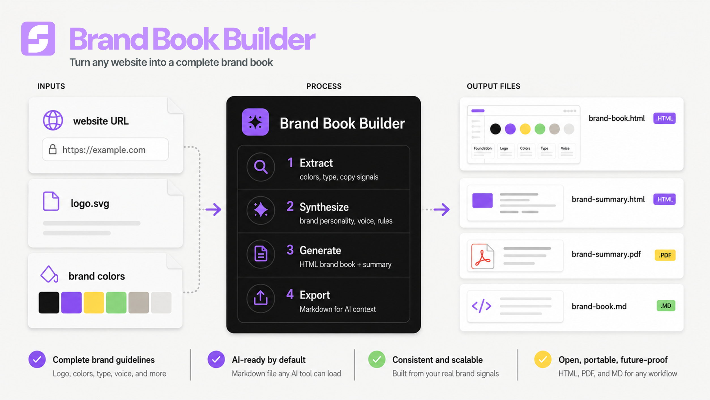

# Brand Book Builder



Takes a website URL and turns it into a complete brand guidelines document — the kind a designer, copywriter, or contractor can pick up and immediately use. One run produces four files: a comprehensive HTML brand book, a shareable one-pager, a print-ready PDF, and a structured Markdown reference any AI tool can load as context.

Install and run with `/brand-book`.

---

## What it produces

- **`brand-book.html`** — Full brand guidelines: cover page, brand foundation, logo rules, color palette, typography system, imagery direction, voice and tone, and brand-in-use mockups. Rendered entirely in the brand's own colors and fonts. Sticky sidebar nav, responsive, print-ready.
- **`brand-summary.html`** — A quick-reference one-pager: logo, color swatches, type specimens, personality keywords, and one on-brand vs off-brand copy pair. Two to three screens tall, built to screenshot or print.
- **`brand-summary.pdf`** — The one-pager rendered to A4 PDF via Playwright. No timestamps, headers, or page numbers.
- **`brand-book.md`** — A structured Markdown version of the brand book for LLM consumption. Drop it into any AI tool's context and it knows the brand's colors, fonts, voice, and rules without the HTML.

See [`examples/`](./examples) for a sample of what each file looks like.

---

## How it works

The skill visits the website, extracts every visual and copy signal it can find — hex values from computed CSS, font declarations, heading structure, CTA copy, About page language — and synthesises that into a brand document, not just a visual inventory.

- **Website only.** No supplemental assets provided. The skill extracts everything from the URL and notes where it had to infer.
- **Website + logo SVG.** Embeds the SVG inline so the brand book can display logo variants on different backgrounds. If the logo is only raster on the site, the skill asks for an SVG before proceeding.
- **Website + SVG + additional brand colors or values.** Anything provided directly overrides what the site shows. Conflicts are noted.

Before finishing, the skill checks its own output: are the hex values accurate? Do the type specimens actually render in the brand fonts? Are the voice examples specific enough that a copywriter could use them?

---

## Install

Copy the skill into your project or user-level skills directory:

```bash
# Project-level (applies to one project)
mkdir -p .claude/skills/brand-book
cp path/to/SKILL.md .claude/skills/brand-book/SKILL.md

# User-level (applies to all Claude Code sessions)
mkdir -p ~/.claude/skills/brand-book
cp path/to/SKILL.md ~/.claude/skills/brand-book/SKILL.md
```

Then in Claude Code, type:

```
/brand-book
```

---

## Use

The skill asks for a URL upfront, then runs. If it needs an SVG logo or additional brand values, it asks before generating anything.

The four output files land in your working directory (or a path you specify). To use `brand-book.md` as persistent visual context, add it to your `CLAUDE.md`:

```
@/path/to/brand-book.md
```

Any AI tool that reads it — Claude, Cursor, v0 — will know the brand's exact colors, fonts, and rules before generating anything.

---

## When to use

- You want `brand-book.md` as a persistent context file so any LLM can generate graphics, websites, and visual assets that match your brand
- You're onboarding a designer or agency and need a single document they can work from
- A contractor is producing content and you need to give them something more useful than "here's our website"
- You've never written down what your brand looks like or sounds like, and you need a starting point
- The brand evolved — new colors, new positioning — and the old documentation hasn't caught up
- You're building a second brand (product, sub-brand, personal brand) and need guidelines fast
- You want to audit what your website is actually communicating, not what you think it is

## When not to use

- You need a writing system that controls how Claude drafts — that's the Brand Voice Builder (`brand-context.md` + `voice.md`), which goes deeper into rhythm, drift controls, and rewrite patterns
- You need brand guidelines from scratch with no website — the skill is built around extracting signals from a live URL
- You want a design system with tokenised variables, component rules, and AI-executable DESIGN.md — that's the Brand OS
- You need the PDF to match print specs exactly — the PDF is generated from HTML via Playwright and is suitable for sharing, not commercial print production
